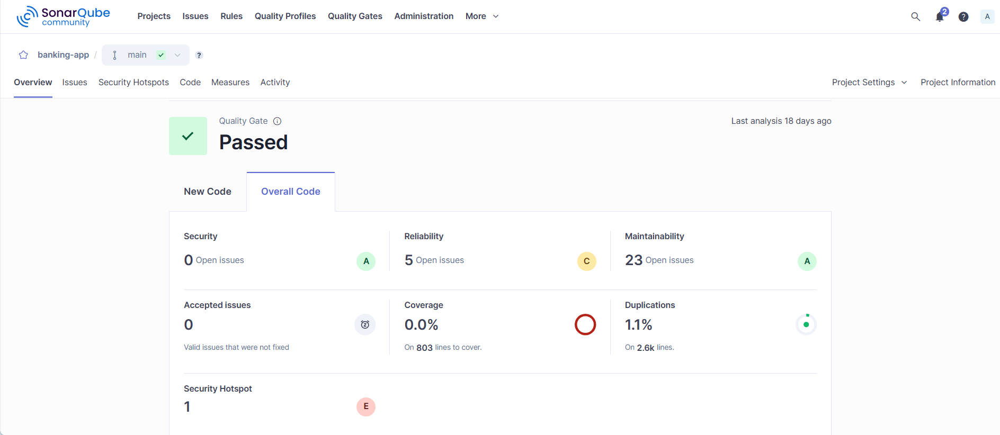
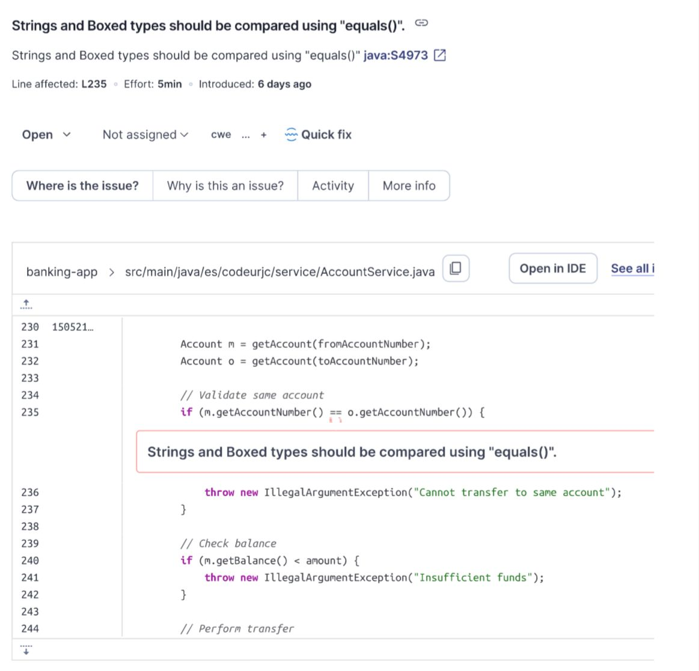
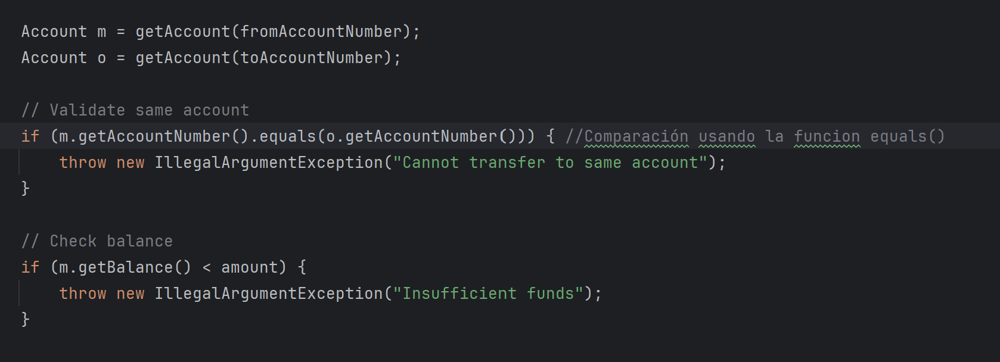
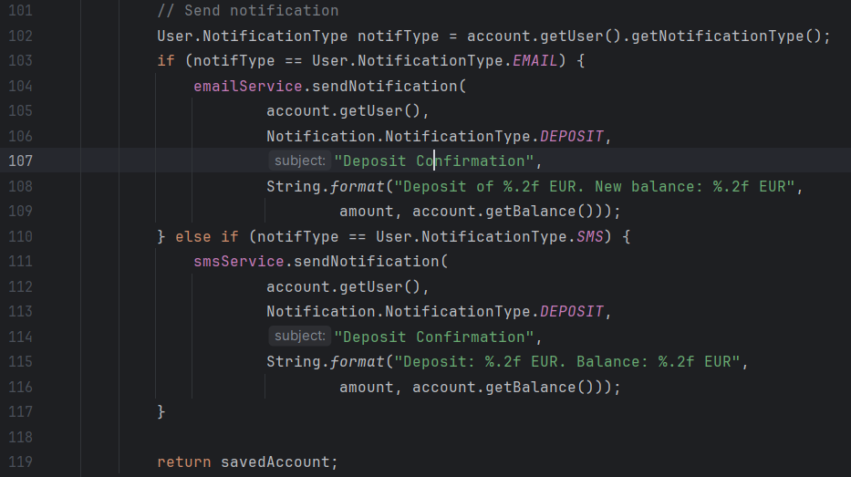
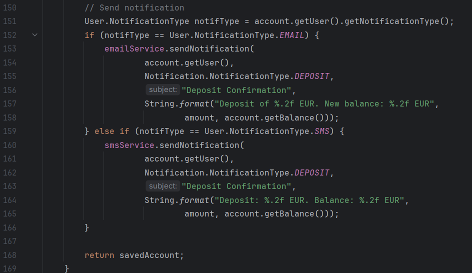
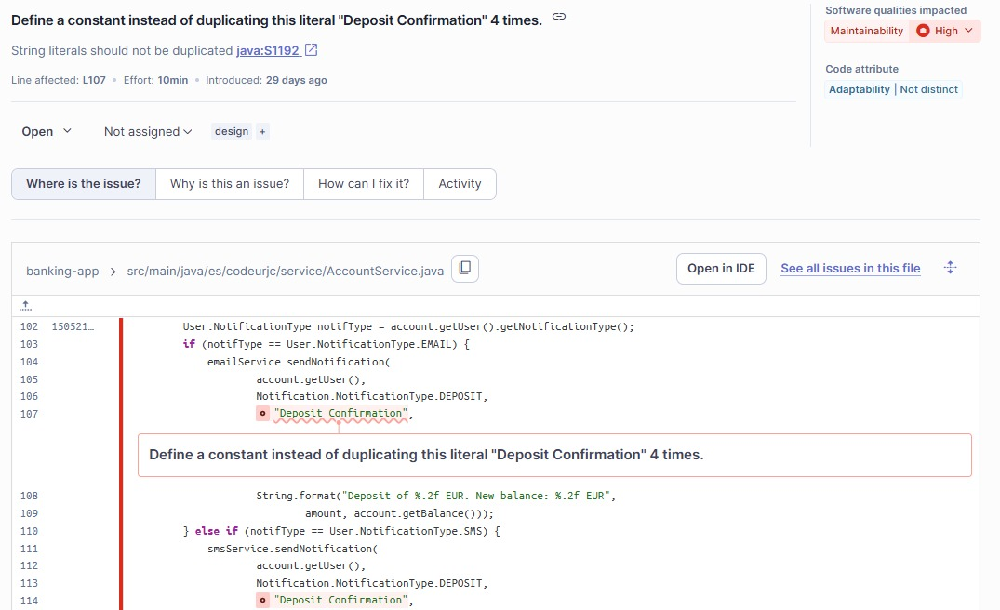
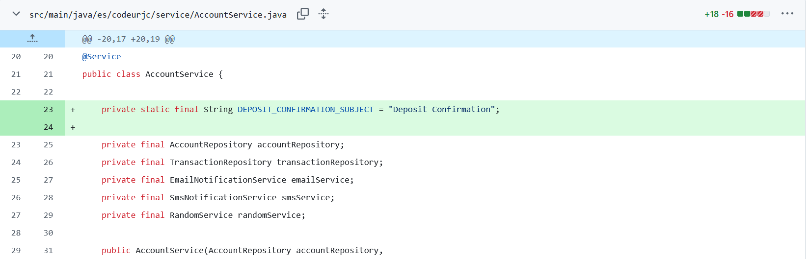
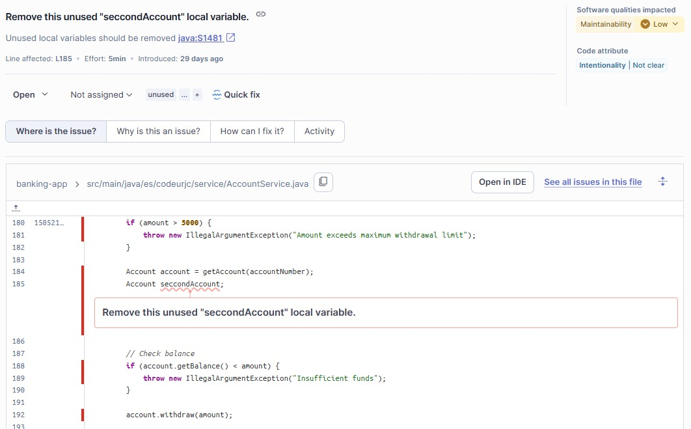
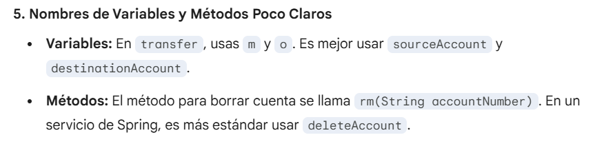

# Tarea 1 y 3: Análisis de Calidad del Código y Refactorización

## Captura de Pantalla del Overview de SonarQube



## Análisis de Calidad - Issues 

A continuación se muestra un resumen de los issues encontrados en el análisis de calidad realizado con SonarQube y mediante el análisis manual del código:

### Issue 1: Strings and Boxed types should be compared using "equals()".

**Reporte de la issue**

En el análisis realizado con SonarQube se ha detectado un problema de calidad que indica:  
“Los Strings deben ser comparados usando la funcion equals()”.  
A continuación se muestra la captura de pantalla de la issue reportada por SonarQube, donde
se observa la comparación incorrecta de dos Strings diferentes en la clase AccountService:



**Explicación de los alumnos del mal olor detectado:** 
El operador `==` en Java compara si dos variables apuntan al mismo espacio en memoria, independientemente de su contenido. Esto significa que el código no valida realmente si los números de cuenta (String) provienen de objetos distintos.

Consideramos que se trata de un **issue real** ya que este defecto permite que un usuario realice transferencias hacia su propia cuenta, vulnerando las reglas del sistema. Su corrección es crítica para mantener la integridad de la lógica de negocio y evitar transacciones inválidas en la aplicación.

**Refactorización**


Al utilizar equals(), el sistema evaluará correctamente si las cadenas de caracteres (números de cuenta) coinciden posición a posición, lo que garantizará que la condición se cumpla siempre que las cuentas sean idénticas.

### Issue 2: Logic and code should not be duplicated (DRY Principle)

**Reporte de la issue:**

Al analizar el código a mano hemos comprobado un mal olor bastante notable en ciertas partes: existen bloques de código idénticos repartidos en diferentes métodos de la clase AccountService (específicamente entre las líneas 102-116 y 151-165). 
SonarQube y otros analizadores estáticos marcan esto como una violación del principio DRY (Don't Repeat Yourself).
Adjunto capturas de las lineas de código:





**Explicación de los alumnos del mal olor detectado:**
Duplicación de Código (Bloque de Depósito): Los métodos deposit(String, double, String) y deposit(String, double) son prácticamente idénticos.

No es un falso positivo porque la duplicación no es accidental ni necesaria por restricciones técnicas. 
Es el resultado de un "Copy-Paste" que introduce rigidez en el diseño y aumenta el riesgo de errores de sincronización de lógica en futuras modificaciones.

**Refactorización**

Creamos una nueva función privada para que los métodos deposit la llamen y no necesiten hacer bloques de código repetidos
```java
private void sendDepositNotification(Account account, double amount) {
    User user = account.getUser();
    User.NotificationType notifType = user.getNotificationType();
    String subject = "Deposit Confirmation";
    double balance = account.getBalance();

    if (notifType == User.NotificationType.EMAIL) {
        emailService.sendNotification(
                user,
                Notification.NotificationType.DEPOSIT,
                subject,
                String.format("Deposit of %.2f EUR. New balance: %.2f EUR", amount, balance));
    } else if (notifType == User.NotificationType.SMS) {
        smsService.sendNotification(
                user,
                Notification.NotificationType.DEPOSIT,
                subject,
                String.format("Deposit: %.2f EUR. Balance: %.2f EUR", amount, balance));
    }
}
```
Ahora, tanto en el depósito con descripción como en el rápido, solo tienes que llamar al método anterior.
El código se reduce drásticamente, ya que el método deposit con 2 argumentos simplemente hace una llamada a la función deposit con 3 parámetros.


### Issue 3: Define a constant instead of duplicating this literal "Deposit Confirmation" 4 times.

**Reporte de la issue:**
En el análisis realizado con SonarQube se ha detectado un problema de calidad que indica:
“Define a constant instead of duplicating this literal "Deposit Confirmation" 4 times” (Define una constante en lugar de duplicar este literal "Deposit Confirmation" 4 veces).
A continuación se muestra la captura de pantalla de la issue reportada por SonarQube, donde se observa la repetición de la misma cadena de texto en diferentes llamadas a métodos (como emailService y smsService) dentro de la clase AccountService:



**Explicación de los alumnos del mal olor detectado:** 
El uso repetido de cadenas de texto literales a lo largo del código viola el principio DRY (Don't Repeat Yourself). Si en el futuro los requisitos cambian y es necesario modificar el asunto del mensaje, el desarrollador tendría que buscar y actualizar manualmente cada una de las apariciones de ese texto en la clase, lo que es propenso a errores u olvidos.

Consideramos que se trata de un issue real, específicamente un code smell que afecta negativamente a la mantenibilidad del software (marcada como "High" en SonarQube).

**Refactorización**
Previamente teníamos en el código 4 veces "Deposit Confirmation" en las llamadas a los servicios de notificación en los métodos deposit(). Para cumplir el principio DRY declaramos la constante DEPOSIT_CONFIRMATION_SUBJECT y sustituimos los 4 "Deposit Confirmation" por la constante creada.



### Issue 4: Remove this unused "seccondAccount" local variable.

*Reporte de la issue*
En el análisis realizado con SonarQube se ha detectado un problema de calidad que indica:
“Remove this unused "secondAccount" local variable” (Elimina esta variable local "secondAccount" no utilizada)
A continuación se muestra la captura de pantalla de la issue reportada por SonarQube, donde se observa la declaración de la variable local Account secondAccount:



*Explicación de los alumnos del mal olor detectado:* 
El error se encuentra en el método withdraw de la clase AccountService. Se declara la variable local Account seccondAccount pero esta nunca se inicializa, asigna ni usa en ningún punto del método.

Consideramos que se trata de un issue real, específicamente un code smell que afecta negativamente a la mantenibilidad del software (marcada como "High" en SonarQube).

*Refactorización*

### Issue 5: Non-descriptive Naming Conventions.

En el análisis realizado con SonarQube se ha detectado un problema de mantenibilidad que indica:
“Los nombres de variables y métodos deben ser claros y descriptivos para facilitar la comprensión del código”.
A continuación se muestra la captura de pantalla de la issue reportada por SonarQube en la clase AccountService:



**Explicación de los alumnos del mal olor detectado:**
Se han identificado dos deficiencias principales relacionadas con la semántica del código:
- Variables de una sola letra: En el método transfer, se utilizan nombres como m y o. Esto oscurece la lógica de negocio, ya que el desarrollador debe deducir por el contexto cuál es la cuenta que emite los fondos y cuál la que los recibe.
- Abreviaturas no estándar: El método encargado de la eliminación de cuentas utiliza el nombre rm. Aunque es una abreviatura común en entornos de terminal (Unix), en el desarrollo de servicios con Java y Spring se considera una mala práctica, prefiriéndose nombres que utilicen verbos completos y descriptivos.

Consideramos que se trata de un issue real de calidad. La falta de claridad en los nombres aumenta la "carga cognitiva" necesaria para entender el flujo de una transferencia bancaria, lo que puede derivar en errores de mantenimiento o en una curva de aprendizaje más lenta para nuevos miembros del equipo.
**Refactorización**
