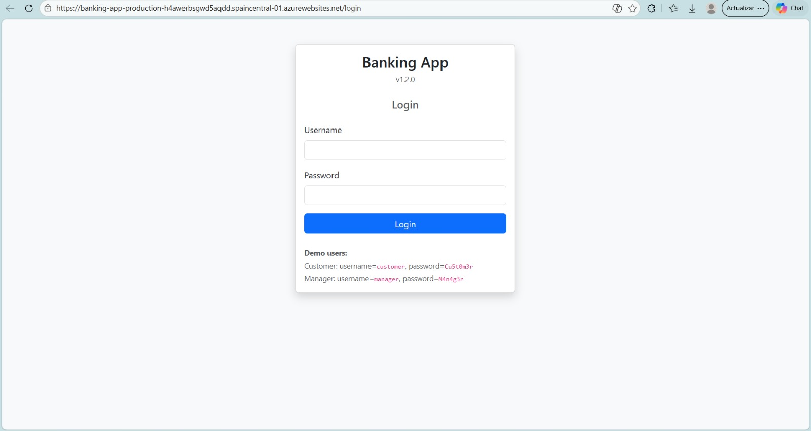
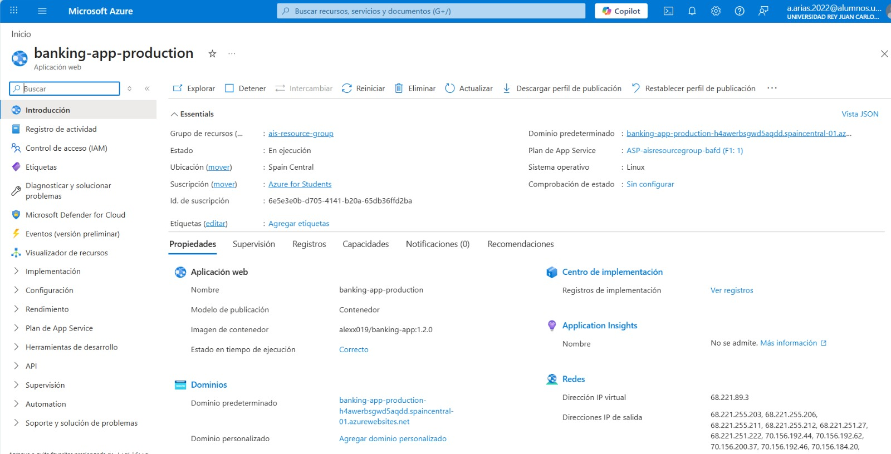

# Praćtica 1 - Control de calidad de una aplicación web

**Grupo A**

## Miembros del Equipo

| Nombre y Apellidos       | Correo URJC                       | Usuario GitHub     |
| :----------------------- | :-------------------------------- | :----------------- |
| Rodrigo Wiznez Valiente  | r.wiznez.2022@alumnos.urjc.es     | rwiznezvaliente-ui |
| Alvaro Gonzalez Gonzalez | a.gonzalezgo.2022@alumnos.urjc.es | alvarognnzlez      |
| Pablo Cristina Jiménez   | p.cristina.2022@alumnos.urjc.es   | pablooo13          |
| Vicente Navas Martínez   | v.navas.2022@alumnos.urjc.es      | vicentenavasmar    |
| Alejandro Arias Souto    | a.arias.2022@alumnos.urjc.es      | Alexx019           |

---

### **Participación de Miembros en la Práctica 1**

#### **Alumno 1 - [Rodrigo Wiznez Valiente]**

Acerca de mis tareas y rol en el grupo, me he encargado de entender e implementar la funcionalidad de preaprobación de préstamos con TDD, además de las otras tareas, las cuales nos hemos repartido por partes iguales.

| Nº  |                                                           Commits                                                            |
| :-: | :--------------------------------------------------------------------------------------------------------------------------: |
|  1  |       [Issue detectada](https://github.com/Alexx019/ais-2026-grupo-A/commit/696644546e78c998a2424253897dda432fbe73e1)        |
|  2  | [Prueba unitaria implementada](https://github.com/Alexx019/ais-2026-grupo-A/commit/64f726fe108d553512c1ec28c33df9210ed4cf9d) |
|  3  | [Refactorización implementada](https://github.com/Alexx019/ais-2026-grupo-A/commit/81aa48072df3234f5e4e7cd7d8475c42568f9158) |
|  4  |   [Caso de TDD implementado](https://github.com/Alexx019/ais-2026-grupo-A/commit/c9f323b037dfa2cd78b1143902902ee1fa6abb97)   |
|  5  |                                        [Prueba de sistema implementada](https://github.com/Alexx019/ais-2026-grupo-A/commit/97e98975cb5ed77afef90da9dba98c745e47153d)                                        |

---

#### **Alumno 2 - Alvaro Gonzalez Gonzalez**

En mi caso, yo me he enfocado especialmente en el uso de Selenium WebDriver para la realización de la tarea 5, supervisando los test creados para la clase TransferE2ETest

| Nº  |                                                           Commits                                                            |
| :-: |:----------------------------------------------------------------------------------------------------------------------------:|
|  1  |       [Issue detectada](https://github.com/Alexx019/ais-2026-grupo-A/commit/c0e4988782f4c8d181b291447f3ce59aeeb253c3)        |
|  2  |  [Prueba unitaria implementada](https://github.com/Alexx019/ais-2026-grupo-A/commit/d44893494b94fc23745bab45317fc7f42dbf7da0)  |
|  3  |  [Refactorización implementada](https://github.com/Alexx019/ais-2026-grupo-A/commit/f56c9582764204a26be785938bc943b6f8d52dd8)  |
|  4  |    [Caso de TDD implementado](https://github.com/Alexx019/ais-2026-grupo-A/commit/f2d9f6cb942c51d458b5477d1ccaa022412257d5)    |
|  5  | [Prueba de sistema implementada](https://github.com/Alexx019/ais-2026-grupo-A/commit/8566172b751f5f9e3d076cd425be7f19497e949b) |

---

#### **Alumno 3 - Pablo Cristina Jiménez**

En cuanto a mis tareas y responsabilidades en el proyecto he participado en el todos los puntos que este requería, las tareas se han repartido a partes iguales, haciendo especial hincapie al principio en los issues de DRY, y finalmente realizando tests en TDD y pruebas web.

| Nº  |                                                           Commits                                                            |
| :-: | :--------------------------------------------------------------------------------------------------------------------------: |
|  1  |       [Issue detectada](https://github.com/Alexx019/ais-2026-grupo-A/commit/2e95de3e2a1b745c02cecb1b5685f2efbd4cc6c8)        |
|  2  | [Prueba unitaria implementada](https://github.com/Alexx019/ais-2026-grupo-A/commit/1101cae15021ecf0138a8caf2c994f05c352a5b0) |
|  3  | [Refactorización implementada](https://github.com/Alexx019/ais-2026-grupo-A/commit/d07080313f5e14c6fab3d611b437cacc9b676015) |
|  4  |                                           [Caso de TDD implementado](https://github.com/Alexx019/ais-2026-grupo-A/commit/3bb05a204661003f727956e5f797aa693b52538b)                                           |
|  5  |                                        [Prueba de sistema implementada](https://github.com/Alexx019/ais-2026-grupo-A/commit/1d2bd3ca9c138e09f1b944e8c15c877fc59e9c59)                                        |

---

#### **Alumno 4 - Vicente Navas Martinez**

En cuanto a mis tareas y responsabilidades en el proyecto, he contribuido en todas las tareas que nos repartimos entre los miembros del grupo. Especialmente en las pruebas unitarias y en la implementación de pruebas de sistema.

| Nº  |                                                           Commits                                                            |
| :-: | :--------------------------------------------------------------------------------------------------------------------------: |
|  1  |       [Issue detectada](https://github.com/Alexx019/ais-2026-grupo-A/commit/23ca1e2169ebed6723915f874f154bbde426fc75)        |
|  2  | [Prueba unitaria implementada](https://github.com/Alexx019/ais-2026-grupo-A/commit/00c0f410d9ce94405c2bc43050a372abc7c133f6) |
|  3  | [Refactorización implementada](https://github.com/Alexx019/ais-2026-grupo-A/commit/3005b543e41c4bbb9ff82e3f9ff3c88b67db6ea9) |
|  4  |                                           [Caso de TDD implementado](https://github.com/Alexx019/ais-2026-grupo-A/commit/1bb7a7ca40f3147b451df761efd599c4274fd68e)                                           |
|  5  |                                        [Prueba de sistema implementada](https://github.com/Alexx019/ais-2026-grupo-A/commit/36e7ecbf4c46697656383d425b3702077f7f7671)                                        |

---

#### **Alumno 5 - Alejandro Arias Souto**

En cuanto a responsabilidades, en el equipo yo me encargaba del sonarQube. En cuanto a tareas, he identificado un mal olor de variables y métodos mal nombrados, así como los primeros tests en el TDD. El resto de cosas nos las hemos repartido equitativamente entre todos.

| Nº  |                                                           Commits                                                            |
| :-: | :--------------------------------------------------------------------------------------------------------------------------: |
|  1  |       [Issue detectada](https://github.com/Alexx019/ais-2026-grupo-A/commit/86918a062fb594b488bc13cf0b26cc4d99c95a39)        |
|  2  | [Prueba unitaria implementada](https://github.com/Alexx019/ais-2026-grupo-A/commit/6c2cb5fc47f31cfb14d1e93f06b81137d6b7f422) |
|  3  | [Refactorización implementada](https://github.com/Alexx019/ais-2026-grupo-A/commit/2d343120bbdb8c08f5b228a8c4aae2702aeccbf1) |
|  4  |                                           [Caso de TDD implementado](https://github.com/Alexx019/ais-2026-grupo-A/commit/eeaa8ea374b044cbdd686482b3a9e9075028e478)                                           |
|  5  |                                        [Prueba de sistema implementada](https://github.com/Alexx019/ais-2026-grupo-A/commit/2756cd36d1fd83ce887d891ef158b9be8694dbcf)                                        |

---

# Praćtica 2 - Implementación de pipelines de CI-CD y desarrollo colaborativo 


### Captura de la aplicación desplegada en Azure




### Captura del dashboard de Azure con la última versión desplegada



## Desarrollo con GitHubFlow

### Asignación de tareas

| Tarea 1 | Alumno/es asignado/s | Commits asociado |
|:--- |:--- |:--- |
| Main | [Alejandro Arias Souto] | [Commit](https://github.com/Alexx019/ais-2026-grupo-A/commit/0661e4e79cf0c2e8b8a7400d1f1ace6d325d6060) |


| Tarea 2 | Alumno/es asignado/s | Commits asociado |
|:--- |:--- |:--- |
| Workflow 1 | [Vicente Navas Martínez] | [Commit](https://github.com/Alexx019/ais-2026-grupo-A/commit/38e1d801f41e736ebcb60d7180a02416374b3215) |
| Workflow 2 | [Vicente Navas Martínez] | [Commit](https://github.com/Alexx019/ais-2026-grupo-A/commit/63f4148d247cb879441bc72b0dbabc2c34aeb6ca) |
| Workflow 3 | [Alejandro Arias Souto] | [Commit](https://github.com/Alexx019/ais-2026-grupo-A/commit/9d1aaebc39048400443c059acf2c056d8fbe1e9a) |
| Workflow 4 | [Álvaro Gonzalez Gonzalez] | [Commit](https://github.com/Alexx019/ais-2026-grupo-A/commit/fcb4fb3bce4e3715945c36f4b5bc70d8eaf6c53f) |

| Tarea 3| Alumno/es asignado/s | Commits asociado |
|:--- |:--- |:--- |
| feature-1 | [Rodrigo Wiznez Valiente] , [Vicente Navas Martínez] | [Commit 1](https://github.com/Alexx019/ais-2026-grupo-A/commit/e41be157727b76e4e542a580be4cce16cf707f03) , [Commit 2](https://github.com/Alexx019/ais-2026-grupo-A/commit/5707ff38c7cd498d6fa3e98f1129caf4ede1601f) |
| feature-2 | [Pablo Cristina Jiménez ] , [Pablo Cristina Jiménez ] | [Commit 1](https://github.com/Alexx019/ais-2026-grupo-A/commit/7b90d587abbd5c678c34a27a72bb66966cadd689) , [Commit 2](https://github.com/Alexx019/ais-2026-grupo-A/commit/5af094971bbbe75265420083fccb0352c9d9b85f) |
| refactoring-1 | [Alejandro Arias Souto] | [Commit](URL_commit_5) |
### Pasos seguidos

Una vez creados los workflows y funcionando estos, pasamos a crear la nueva funcionalidad utilizando GithubFlow:

Clonamos el repositorio

```
$ git clone git@github.com:codigus-formacion-se/banking-app-2026.git
```

1. **Actualizar la rama principal y crear la rama de trabajo.** Primero se actualizó `main` para partir de la versión base correcta y después se creó la rama correspondiente a la tarea asignada.

```bash
git checkout main
git pull origin main
git checkout -b feature-2
git push -u origin feature-2
```

- `git checkout main`: cambia a la rama principal.
- `git pull origin main`: descarga la última versión de `main` desde GitHub.
- `git checkout -b feature-2`: crea la rama `feature-2` y cambia a ella.
- `git push -u origin feature-2`: sube la rama a GitHub y la enlaza con la rama remota.

2. **Implementar la funcionalidad.** En la rama creada se desarrolló la nueva funcionalidad pedida en la práctica. En `feature-2`, se añadió el atributo `banned` a la entidad usuario para impedir operaciones cuando su valor fuera `true`.

```bash
# edición del código fuente en la rama feature-2
```

3. **Hacer el commit de funcionalidad.** La práctica exige que el primer commit de cada feature corresponda únicamente a la funcionalidad implementada.

```bash
git add .
git commit -m "Add banned attribute and block operations"
```

- `git add .`: prepara los cambios realizados para incluirlos en el commit.
- `git commit -m "..."`: guarda un commit con el cambio funcional.

4. **Añadir las pruebas unitarias y hacer su commit.** Después se incorporaron las pruebas necesarias para cubrir la nueva funcionalidad, tal como exige el segundo commit de cada feature.

```bash
# edición de los tests unitarios
git add .
git commit -m "Add unit tests for banned users"
```

- `git add .`: añade los cambios de los tests al área de preparación.
- `git commit -m "..."`: crea el commit de pruebas.

5. **Actualizar la versión antes del pull request.** Antes de abrir el pull request a `main`, se actualizó la versión del proyecto en `pom.xml` siguiendo SemVer. Para `feature-2` la versión resultante debía ser `1.1.0`; para `refactoring-1`, `1.1.1`; y para `feature-1`, `1.2.0`.

```bash
# editar pom.xml
git add pom.xml
git commit -m "Bump version to 1.1.0"
```

- Se modifica `pom.xml` con la nueva versión.
- `git add pom.xml`: prepara el cambio de versión.
- `git commit -m "Bump version to 1.1.0"`: guarda el commit del cambio de versión.

6. **Subir la rama a GitHub.** Una vez completados los commits, se subieron todos los cambios de la rama al repositorio remoto.

```bash
git push origin feature-2
```

- `git push origin feature-2`: publica en GitHub todos los commits realizados en la rama.

7. **Crear el pull request.** Con la rama ya publicada, se abrió un pull request desde `feature-2` hacia `main`, que es el mecanismo obligatorio de integración indicado en la práctica. En este paso se ejecuta el workflow asociado a las pull requests contra `main`, por lo que en la memoria debe incluirse también el enlace a esa ejecución.

```bash
# el pull request se crea desde la interfaz web de GitHub
# base: main <- compare: feature-2
```

8. **Hacer el merge a `main`.** Tras revisar el pull request y comprobar que los workflows asociados terminaban correctamente, se realizó el merge a `main`. Después se actualizó la rama principal en local para seguir trabajando sobre el estado ya integrado.

```bash
git checkout main
git pull origin main
```

- `git checkout main`: vuelve a la rama principal.
- `git pull origin main`: descarga en local el resultado del merge realizado en GitHub.

## Workflow 4

Todos los días a las XX:XX se ejecuta el job de Nightly que ...

- [ÚLTIMA EJECUCIÓN](URL_ultima_ejecucion_workflow_4)
