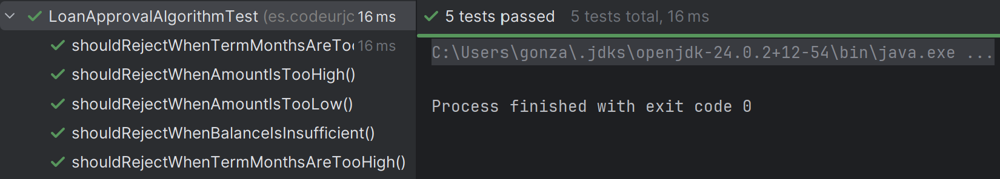
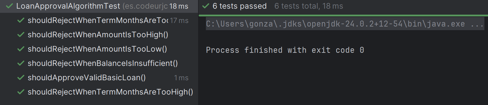
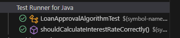
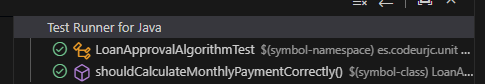
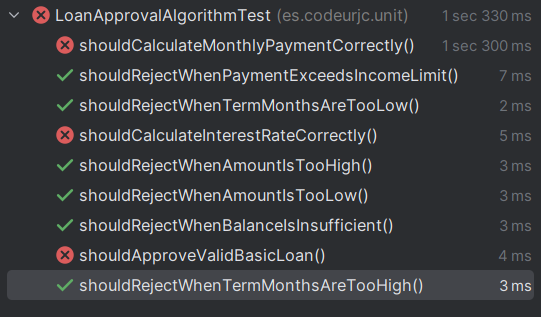
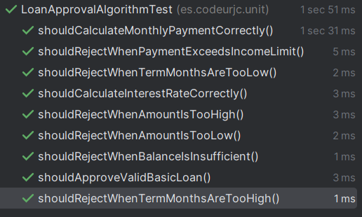
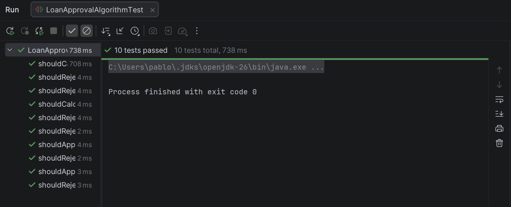

# Tarea 4: Implementación de una funcionalidad con TDD

### Test 1: Debe rechazar si la cantidad es menor a 1000

**INPUT y OUTPUT**: 500 -> "Cantidad fuera de rango"

**Código de test**

```java
@Test
void shouldRejectWhenAmountIsTooLow() {
    LoanRequest request = new LoanRequest();
    request.setAmount(500);
    LoanEvaluationResult result = algorithm.evaluate(request);

    assertFalse(result.isApproved());
    assertEquals("Cantidad fuera de rango", result.getReason());
}
```

**Mensaje del test añadido que NO PASA**

```log
org.opentest4j.AssertionFailedError:
Expected :false
Actual   :true
```

**Código mínimo para que el test pase**

Se añade una condición que verifica la cantidad del préstamo y la compara con el límite inferior (en este caso 1000). Si es inferior se rechaza el préstamo con el mensaje: "Cantidad fuera de rango"

```java
private static final int LIMITE_INFERIOR = 1000;

if (request.getAmount() < LIMITE_INFERIOR){
    return new LoanEvaluationResult(false, "Cantidad fuera de rango");
}
```

**Captura de que TODOS los test PASAN**


### Test 2: Debe rechazar si la cantidad es mayor a 50000

**INPUT y OUTPUT**: 50001 -> "Cantidad fuera de rango"

**Código de test**

```java
@Test
void shouldRejectWhenAmountIsTooHigh() {
    LoanRequest request = new LoanRequest();
    request.setAmount(50001);
    LoanEvaluationResult result = algorithm.evaluate(request);

    assertFalse(result.isApproved());
    assertEquals("Cantidad fuera de rango", result.getReason());
}
```

**Mensaje del test añadido que NO PASA**

```log
org.opentest4j.AssertionFailedError:
Expected :false
Actual   :true
```

**Código mínimo para que el test pase**

Se añade una condición que verifica la cantidad del préstamo y la compara con el límite superior (en este caso 50000). Si es superior se rechaza el préstamo con el mensaje: "Cantidad fuera de rango"

```java
private static final int LIMITE_SUPEIOR = 50000;

if (request.getAmount() < LIMITE_INFERIOR || request.getAmount() > LIMITE_SUPEIOR){
    return new LoanEvaluationResult(false, "Cantidad fuera de rango");
}
```

**Captura de que TODOS los test PASAN**


### Test 3: Debe rechazar si el plazo es menor a 6 meses

**INPUT y OUTPUT**: 5 meses -> "Plazo no válido"

**Código de test**

```java
@Test
void shouldRejectWhenTermMonthsAreTooLow() {
    LoanRequest request = new LoanRequest();
    request.setAmount(1001);
    request.setTermMonths(5);
    LoanEvaluationResult result = algorithm.evaluate(request);

    assertFalse(result.isApproved());
    assertEquals("Plazo no válido", result.getReason());
}
```

**Mensaje del test añadido que NO PASA**

```log
org.opentest4j.AssertionFailedError:
Expected :false
Actual   :true
```

**Código mínimo para que el test pase**

Se añade una condición que verifica el número de meses de plazo. Si es inferior a 6 meses se rechaza el préstamo con el mensaje: "Plazo no válido"

```java
private static final int PLAZO_MESES_MIN = 6;

if (request.getTermMonths() < PLAZO_MESES_MIN){
    return  new LoanEvaluationResult(false, "Plazo no válido");
}
```

**Captura de que TODOS los test PASAN**


### Test 4: Debe rechazar si el plazo es superior a 120 meses

**INPUT y OUTPUT**: 200 meses -> "Plazo no válido"

**Código de test**

```java
@Test
void shouldRejectWhenTermMonthsAreTooHigh() {
    LoanRequest request = new LoanRequest();
    request.setAmount(1001);
    request.setTermMonths(200);
    LoanEvaluationResult result = algorithm.evaluate(request);

    assertFalse(result.isApproved());
    assertEquals("Plazo no válido", result.getReason());
}
```

**Mensaje del test añadido que NO PASA**

```log
org.opentest4j.AssertionFailedError:
Expected :false
Actual   :true
```

**Código mínimo para que el test pase**

Se añade una condición que verifica el número de meses de plazo. Si es superior a 120 meses se rechaza el préstamo con el mensaje: "Plazo no válido"

```java
private static final int PLAZO_MESES_MAX = 120;

if (request.getTermMonths() < PLAZO_MESES_MIN || request.getTermMonths() > PLAZO_MESES_MAX){
    return  new LoanEvaluationResult(false, "Plazo no válido");
}
```
**Captura de que TODOS los test PASAN**


### Test 5: Debe rechazar si el saldo es insuficiente (menor al 20% de la cantidad)
**INPUT y OUTPUT**: Cantidad: 20000, Plazo: 24, Saldo: 3000 -> "Saldo insuficiente"

**Código de test**

```java
@Test
void shouldRejectWhenBalanceIsInsufficient() {
    LoanRequest request = new LoanRequest();
    request.setAmount(20000);
    request.setTermMonths(24);
    request.setCustomerBalance(3000);
    LoanEvaluationResult result = algorithm.evaluate(request);

    assertFalse(result.isApproved());
    assertEquals("Saldo insuficiente", result.getReason());
}
```

**Mensaje del test añadido que NO PASA**

```log
org.opentest4j.AssertionFailedError: 
Expected :false
Actual   :true
```

**Código mínimo para que el test pase**

Se añade una condición que calcula el 20% de la cantidad solicitada y verifica si el saldo del cliente es inferior a ese valor. Si es inferior, se rechaza el préstamo con el mensaje: "Saldo insuficiente".

```java
private static final double PORCENTAJE_SALDO_MINIMO = 0.20;

if (request.getCustomerBalance() < (request.getAmount() * PORCENTAJE_SALDO_MINIMO)) {
    return new LoanEvaluationResult(false, "Saldo insuficiente");
}
```

**Captura de que TODOS los test PASAN**



### Test 6: Debe aprobar un préstamo básico válido 
**INPUT y OUTPUT**: Cantidad: 20000, Plazo: 24, Saldo: 5000 -> "Aprobado"

**Código de test**

```java
@Test
void shouldApproveValidBasicLoan() {
    LoanRequest request = new LoanRequest();
    request.setAmount(20000);
    request.setTermMonths(24);
    request.setCustomerBalance(5000);
    LoanEvaluationResult result = algorithm.evaluate(request);

    assertTrue(result.isApproved(), "El préstamo cumple todo y debería ser aprobado");
    assertEquals("Aprobado", result.getReason());
}
```

**Justificación de prueba exitosa:**

De acuerdo con las instrucciones de la práctica, justificamos que esta prueba pasa de forma inmediata,  durante las iteraciones anteriores al programar los escenarios de rechazo, incluimos un retorno por defecto (return new LoanEvaluationResult(true, "Aprobado");) al final de la función principal. Por tanto, la funcionalidad base de aprobación implícita ya estaba cubierta por descarte.

**Código mínimo para que el test pase**

No es necesario añadir código nuevo en esta iteración. La lógica de la clase se mantiene exactamente igual que en el Test 5, ya que la condición de aprobación se cumple si el flujo de ejecución no entra en ninguno de los if de rechazo anteriores.

**Captura de que TODOS los test PASAN**



### Test 7: Debe calcular el interés correctamente

**INPUT y OUTPUT**: Euribor mockeado a 3.14 -> Interés = 2% + 3.14% = 5.14%

**Código de test**

```java
@Test
void shouldCalculateInterestRateCorrectly() {
    Mockito.when(euriborServiceMock.getEuribor()).thenReturn(3.14);
    LoanRequest request = new LoanRequest();
    request.setAmount(20000);
    request.setTermMonths(24);
    request.setCustomerBalance(5000);
    LoanEvaluationResult result = algorithm.evaluate(request);

    assertTrue(result.isApproved());
    assertEquals(5.14, result.getInterestRate(), 0.001);
}
```

**Mensaje del test añadido que NO PASA**

```log
org.opentest4j.AssertionFailedError:
Expected :5.14
Actual   :0.0
```

**Código mínimo para que el test pase**

Se inyecta un `EuriborService` a través del constructor y se calcula añadiendo una base del 2% al Euribor devuelto por el servicio externo.

```java
private static final double TASA_BASE = 2.0;

double interestRate = TASA_BASE + euriborService.getEuribor();
return new LoanEvaluationResult(true, "Aprobado", request.getAmount(), interestRate, 0.0);
```

**Captura de que TODOS los test PASAN**



### Test 8: Debe calcular la cuota mensual correctamente

**INPUT y OUTPUT**: Préstamo de 20000€ a 24 meses, Euribor al 3.0% (Interés total 5.0%) -> Cuota mensual = 875.0€

**Código de test**

```java
@Test
void shouldCalculateMonthlyPaymentCorrectly() {
    Mockito.when(euriborServiceMock.getEuribor()).thenReturn(3.0);
    LoanRequest request = new LoanRequest();
    request.setAmount(20000);
    request.setTermMonths(24);
    request.setCustomerBalance(5000);
    LoanEvaluationResult result = algorithm.evaluate(request);

    assertTrue(result.isApproved());
    assertEquals(875.0, result.getMonthlyPayment(), 0.001);
}
```

**Mensaje del test añadido que NO PASA**

```log
org.opentest4j.AssertionFailedError:
Expected :875.0
Actual   :0.0
```

**Código mínimo para que el test pase**

Se calcula la cuota mensual dividiendo el total a pagar (principal más intereses) entre el número de meses.

```java
double totalAmount = request.getAmount() + (request.getAmount() * (interestRate / 100));
double monthlyPayment = totalAmount / request.getTermMonths();
return new LoanEvaluationResult(true, "Aprobado", request.getAmount(), interestRate, monthlyPayment);
```

**Captura de que TODOS los test PASAN**



### Test 9: Debe rechazar si la cuota supera el 40% de los ingresos mensuales

**INPUT y OUTPUT**: Préstamo de 20000€ a 24 meses, saldo de 5000€, ingresos mensuales de 2000€ y Euribor al 3.0% -> "Cuota demasiado alta"

**Código de test**

```java
@Test
    void shouldRejectWhenPaymentExceedsIncomeLimit() {
        Mockito.when(euriborServiceMock.getEuribor()).thenReturn(3.0);
        LoanRequest request = new LoanRequest();
        request.setAmount(20000);
        request.setTermMonths(24);
        request.setCustomerBalance(5000);
        request.setMonthlyIncome(2000);

        LoanEvaluationResult result = algorithm.evaluate(request);

        assertFalse(result.isApproved());
        assertEquals("Cuota demasiado alta", result.getReason());
    }
```

**Mensaje del test añadido que NO PASA**

```log
org.opentest4j.AssertionFailedError: 
Expected :false
Actual   :true
```

**Código mínimo para que el test pase**

Se añade una condición que comprueba si la cuota mensual calculada supera el 40% de los ingresos mensuales del cliente. Si lo supera, se rechaza el préstamo con el mensaje: "Cuota demasiado alta".

```java
if (monthlyPayment > request.getMonthlyIncome() * 0.40) {
    return new LoanEvaluationResult(false, "Cuota demasiado alta");
}
```

**Captura de que TODOS los test NO PASAN**



**Refactorización**

Se añade setMonthlyIncome(3000) a los tests 6, 7 y 8 porque al introducir la regla del 40% de ingresos, los préstamos sin ingresos definidos (0€ por defecto) eran rechazados.

```java
request.setMonthlyIncome(3000);
```
**Captura de que TODOS los tests PASAN tras la refactorización**



### Test 10: Debe aprobar un préstamo cuando la cuota está dentro del límite de ingresos (Caso frontera Cuota <= 40%)

**INPUT y OUTPUT**: Cantidad: 20000, Plazo: 24, Saldo: 5000, Ingresos: 2200, Euribor (Mock): 3.0 -> "Aprobado"

**Código de test**
```java
@Test
    void shouldApproveWhenPaymentIsWithinIncomeLimit() {

        Mockito.when(euriborServiceMock.getEuribor()).thenReturn(3.0);

        LoanRequest request = new LoanRequest();
        request.setAmount(20000);
        request.setTermMonths(24);
        request.setCustomerBalance(5000);
        request.setMonthlyIncome(2200);

        LoanEvaluationResult result = algorithm.evaluate(request);

        assertTrue(result.isApproved());
        assertEquals("Aprobado", result.getReason());
    }
```
**Justificación de prueba exitosa:**

Justificamos que esta prueba pasa sin necesidad de ningún cambio porque al programar lo necesario para el test anterior ya se implementó la comprobación "if (monthlyPayment > request.getMonthlyIncome() * 0.40)" utilizando el operador mayor que (>). Por ello, cualquier valor que sea menor o exactamente igual al límite no activa el rechazo y permite que el flujo continúe hasta el retorno de éxito final.

**Código mínimo para que el test pase:**

No es necesario añadir código nuevo en esta iteración. La lógica de la clase se mantiene exactamente igual, ya que el diseño previo contemplaba correctamente el caso límite gracias al uso del operador (>) en la regla de negocio de la cuota máxima.

**Captura de que TODOS los test PASAN**




