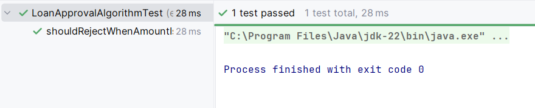
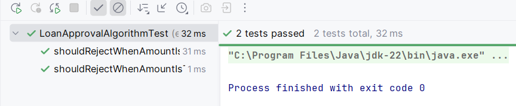
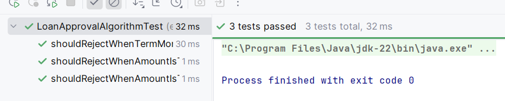
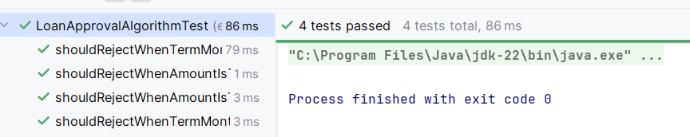

# Tarea 4: Implementación de una funcionalidad con TDD 


### Test 1: Debe rechazar si la cantidad es menor a 1000

**INPUT y OUTPUT**: 500 -> "Cantidad fuera de rango"

**Código de test**
```java
@Test
void shouldRejectWhenAmountIsTooLow() {
    LoanRequest request = new LoanRequest();
    request.setAmount(500);
    LoanEvaluationResult result = algorithm.evaluate(request);

    assertFalse(result.isApproved());
    assertEquals("Cantidad fuera de rango", result.getReason());
}
```

**Mensaje del test añadido que NO PASA**

```log
org.opentest4j.AssertionFailedError: 
Expected :false
Actual   :true
```

**Código mínimo para que el test pase**

Se añade una condición que verifica la cantidad del préstamo y la compara con el límite inferior (en este caso 1000). Si es inferior se rechaza el préstamo con el mensaje: "Cantidad fuera de rango"

```java
private static final int LIMITE_INFERIOR = 1000;

if (request.getAmount() < LIMITE_INFERIOR){
    return new LoanEvaluationResult(false, "Cantidad fuera de rango");
}
```

**Captura de que TODOS los test PASAN**



### Test 2: Debe rechazar si la cantidad es mayor a 50000

**INPUT y OUTPUT**: 50001 -> "Cantidad fuera de rango"

**Código de test**
```java
@Test
void shouldRejectWhenAmountIsTooHigh() {
    LoanRequest request = new LoanRequest();
    request.setAmount(50001);
    LoanEvaluationResult result = algorithm.evaluate(request);

    assertFalse(result.isApproved());
    assertEquals("Cantidad fuera de rango", result.getReason());
}
```

**Mensaje del test añadido que NO PASA**

```log
org.opentest4j.AssertionFailedError: 
Expected :false
Actual   :true
```

**Código mínimo para que el test pase**

Se añade una condición que verifica la cantidad del préstamo y la compara con el límite superior (en este caso 50000). Si es superior se rechaza el préstamo con el mensaje: "Cantidad fuera de rango"

```java
private static final int LIMITE_SUPEIOR = 50000;

if (request.getAmount() < LIMITE_INFERIOR || request.getAmount() > LIMITE_SUPEIOR){
    return new LoanEvaluationResult(false, "Cantidad fuera de rango");
}
```

**Captura de que TODOS los test PASAN**



### Test 3: Debe rechazar si el plazo es menor a 6 meses

**INPUT y OUTPUT**: 5 meses -> "Plazo no válido"

**Código de test**
```java
@Test
void shouldRejectWhenTermMonthsAreTooLow() {
    LoanRequest request = new LoanRequest();
    request.setAmount(1001);
    request.setTermMonths(5);
    LoanEvaluationResult result = algorithm.evaluate(request);

    assertFalse(result.isApproved());
    assertEquals("Plazo no válido", result.getReason());
}
```

**Mensaje del test añadido que NO PASA**

```log
org.opentest4j.AssertionFailedError: 
Expected :false
Actual   :true
```

**Código mínimo para que el test pase**

Se añade una condición que verifica el número de meses de plazo. Si es inferior a 6 meses se rechaza el préstamo con el mensaje: "Plazo no válido"

```java
private static final int PLAZO_MESES_MIN = 6;

if (request.getTermMonths() < PLAZO_MESES_MIN){
    return  new LoanEvaluationResult(false, "Plazo no válido");
}
```

**Captura de que TODOS los test PASAN**




### Test 4: Debe rechazar si el plazo es superior a 120 meses

**INPUT y OUTPUT**: 200 meses -> "Plazo no válido"

**Código de test**
```java
@Test
void shouldRejectWhenTermMonthsAreTooHigh() {
    LoanRequest request = new LoanRequest();
    request.setAmount(1001);
    request.setTermMonths(200);
    LoanEvaluationResult result = algorithm.evaluate(request);

    assertFalse(result.isApproved());
    assertEquals("Plazo no válido", result.getReason());
}
```

**Mensaje del test añadido que NO PASA**

```log
org.opentest4j.AssertionFailedError: 
Expected :false
Actual   :true
```

**Código mínimo para que el test pase**

Se añade una condición que verifica el número de meses de plazo. Si es superior a 120 meses se rechaza el préstamo con el mensaje: "Plazo no válido"

```java
private static final int PLAZO_MESES_MAX = 120;

if (request.getTermMonths() < PLAZO_MESES_MIN || request.getTermMonths() > PLAZO_MESES_MAX){
    return  new LoanEvaluationResult(false, "Plazo no válido");
}
```

**Captura de que TODOS los test PASAN**

